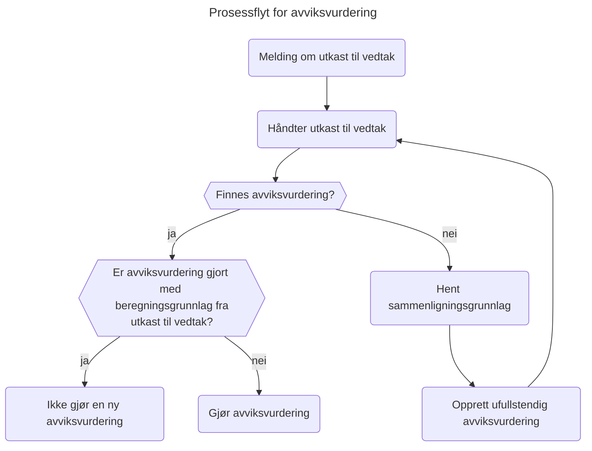
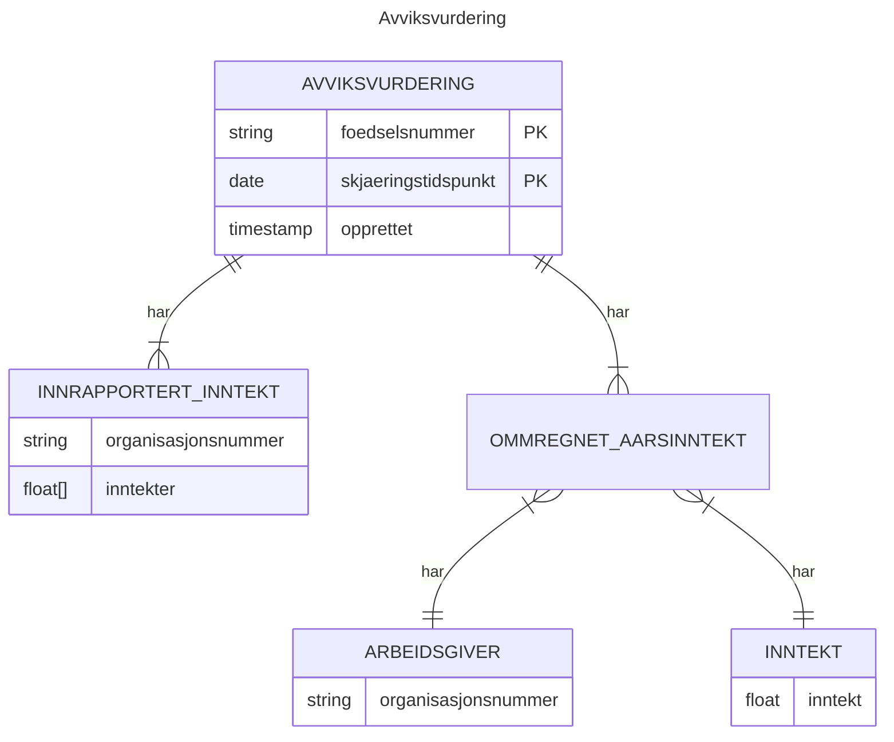

# Spinnvill

## Beskrivelse
Backend som vurderer automatisk behandling av sykepengesøknader

## Henvendelser
Spørsmål knyttet til koden eller prosjektet kan stilles som issues her på GitHub.

## Format på Commit-meldinger 
I dette repoet skal det commites på dette formatet:
- `[gitmoji] [teksten din]`

  gitmoji finner du her: (https://gitmoji.dev/)
- Eksempel: ✅ Test automatisering uten varsel

NB: Husk å bytte til å bruke unicode characters i stedet for `:<emote>:` notasjon

## Avviksvurdering
### Konsept

### Datamodell

### For NAV-ansatte
Interne henvendelser kan sendes via Slack i kanalen [#team-bømlo-værsågod](https://nav-it.slack.com/archives/C019637N90X).